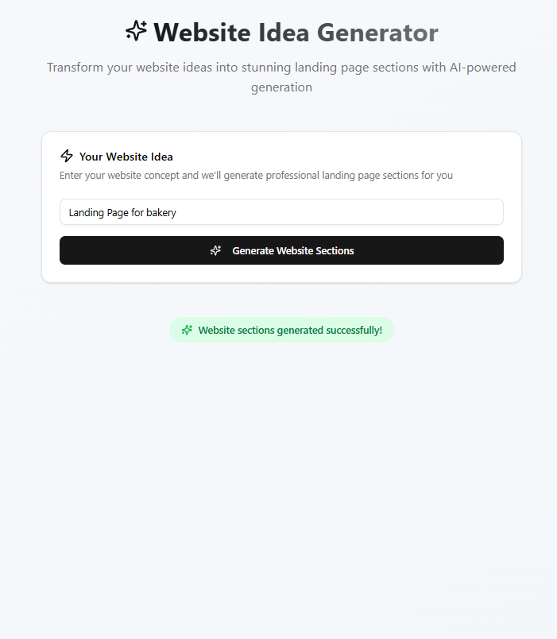
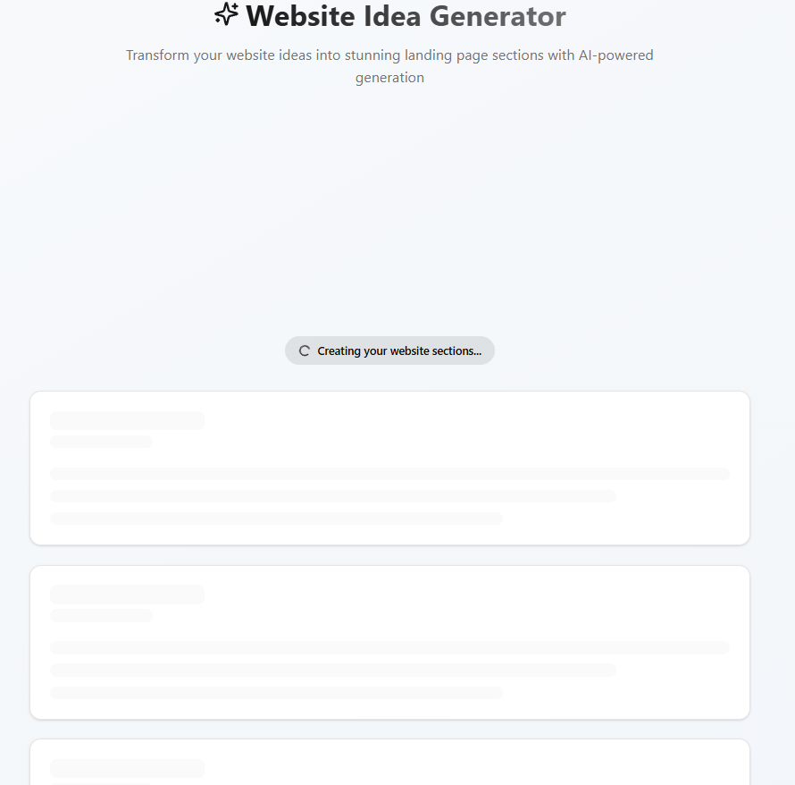

# 🚀 AI-Powered Landing Page Generator

This is a full-stack web application that allows users to input a website idea. The system dynamically generates professional dummy content for a landing page (e.g., Hero, About, Contact sections), stores it in a MongoDB database, and displays it as an instant preview.





## ✨ Core Features

- **Simple User Interface**: Clean and intuitive input form.
- **Dynamic Content Generation**: Backend generates custom text based on user input.
- **Persistent Storage**: Saves ideas and generated sections in MongoDB.
- **Instant Preview**: Renders generated content immediately.
- **Interactive Loading State**: Skeleton animations and loading indicators.
- **Error Handling**: Clear error messages on failure.

## ⚙️ Technology Stack

### Frontend
- **Next.js** (App Router)
- **React & TypeScript**
- **Tailwind CSS**
- **shadcn/ui**
- **Axios**

### Backend
- **NestJS** (Node.js framework)
- **Mongoose** (MongoDB ODM)
- **Class Validator & Class Transformer**

### Database
- **MongoDB** (NoSQL database)

### Development & Deployment
- **Docker & Docker Compose**
- **ESLint & Prettier**

## 📁 Project Structure

```
.
├── backend/                # NestJS API Backend
│   ├── src/
│   │   ├── ideas/
│   │   │   ├── dto/
│   │   │   ├── schemas/
│   │   │   ├── ideas.controller.ts
│   │   │   ├── ideas.service.ts
│   │   │   └── ideas.module.ts
│   │   ├── app.module.ts
│   │   └── main.ts
│   ├── .env
│   └── package.json
│
├── src/                    # Next.js Frontend
│   ├── app/
│   │   └── page.tsx        # Main page
│   ├── components/
│   │   └── ui/             # shadcn/ui components
│   ├── hooks/
│   └── lib/
│
├── .env.local              # Frontend environment variables
├── docker-compose.yml      # MongoDB + Mongo Express setup
└── package.json            # Frontend dependencies
```

## 🚀 Getting Started

### Prerequisites

Ensure you have:
- Node.js (v18.18 or later)
- npm (or pnpm/yarn)
- Docker & Docker Compose

### 1. Clone the Repository

```bash
git clone http://github.com/elqady4/innovate_creating__website
cd <PROJECT-FOLDER>
```

### 2. Set Up Environment Variables

**A. Backend (`.env` in `backend/` folder):**

```env
DATABASE_URL="mongodb://localhost:27017/ideasDB"
```

**B. Frontend (`.env.local` in root):**

```env
NEXT_PUBLIC_API_URL=http://localhost:3001/ideas
```

### 3. Run the Database

Start MongoDB and Mongo Express via Docker:

```bash
docker-compose up -d
```

- MongoDB: `localhost:27017`
- Mongo Express (GUI): [http://localhost:8081](http://localhost:8081)

### 4. Install Dependencies

```bash
# Install frontend dependencies
npm install

# Install backend dependencies
cd backend
npm install
cd ..
```

### 5. Run the Application

**Terminal 1: Start Backend**

```bash
cd backend
npm run start:dev
```

> Server runs on [http://localhost:3001](http://localhost:3001)

**Terminal 2: Start Frontend**

```bash
npm run dev
```

> App runs on [http://localhost:3000](http://localhost:3000)

## 📖 How to Use

1. Open [http://localhost:3000](http://localhost:3000)
2. Enter a website idea (e.g., "A specialty coffee shop")
3. Click **"Generate Website Sections"**
4. View loading state and skeleton animations
5. See generated sections (Hero, About, Contact) with custom content
6. Click **"Generate Another Website"** to try again

## 📦 Available Scripts

### Frontend (Root)

| Script            | Description                          |
|-------------------|--------------------------------------|
| `npm run dev`     | Starts development server            |
| `npm run build`   | Builds for production                |
| `npm run start`   | Starts production server             |
| `npm run lint`    | Runs ESLint                          |

### Backend (`/backend`)

| Script               | Description                          |
|----------------------|--------------------------------------|
| `npm run start:dev`  | Starts dev server (watch mode)       |
| `npm run build`      | Builds for production                |
| `npm run start:prod` | Starts production server             |
| `npm run lint`       | Runs ESLint                          |
| `npm run test`       | Runs unit tests                      |
